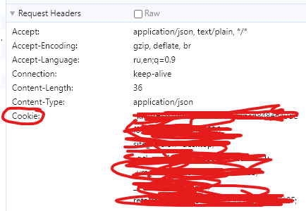

# Инструкции по настройке проекта

## Шаг 1: Получение Токен бота

1. Перейдите в [BotFather](https://t.me/BotFather)
2. Скопируйте Токен вашего телеграмм бота

## Шаг 2: Загрузка переменных в окружение

1. Создайте файл `.env` в корневой папке проекта и заполните его значениями переменных:

    ```
   BOT_TOKEN=
   BOT_CHAT_ID=
    
   POSTGRES_USER=
   POSTGRES_NAME=
   POSTGRES_HOST=
   POSTGRES_PORT=
   POSTGRES_PASSWORD=

   REDIS_NAME=
   REDIS_HOST=
   REDIS_PORT=
   REDIS_PASSWORD=
   REDIS_USER=

   OPENAI_TOKEN=
    ```

2. Скачайте необходимые проекту библиотеки командой:

    ```
    pip install -r requirements.txt
    ```

# Где брать куки для аккаунтов

Куки аккаунта получаем и копируем из хедеров любого запроса к kwork.ru



и вставляем в бд таблица accounts

При успешном подключении к аккаунту, в консоли менеджера будет выводиться
```
Подключился к <ссылка на ваш аккаунт>
```

# Otask
Сейчас для Отаск есть специальный аккаунт Администратора на почту techwizards@gmail.com.
Пространство 03fb3e55-9ab5-4041-a443-4cd4b3aa4dcc